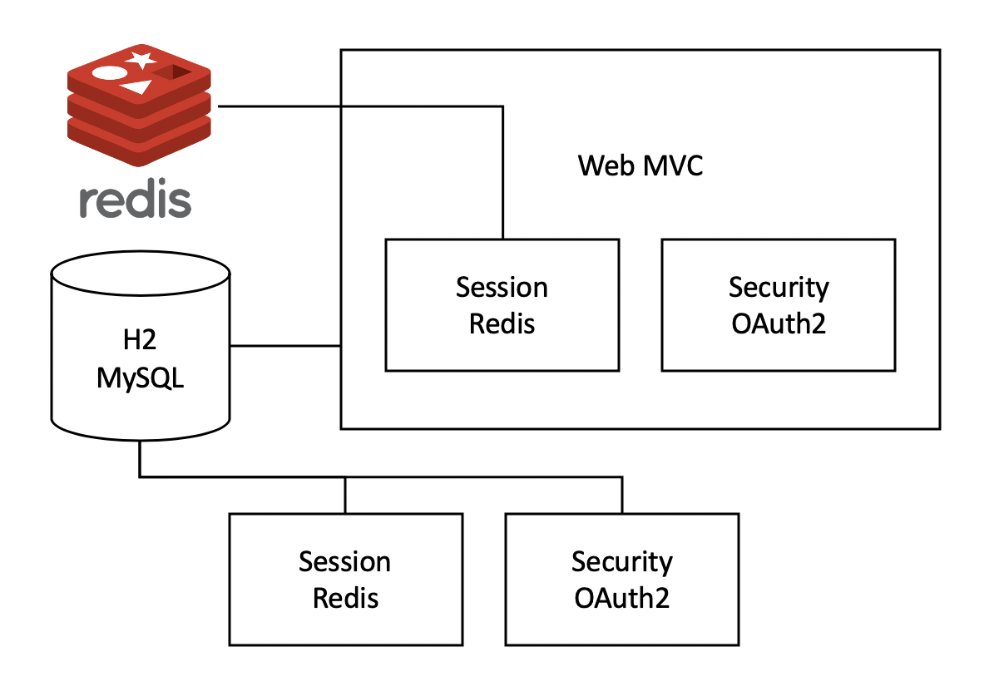

# 스프링 부트(Spring Boot)

 

## 스프링 부트(Spring Boot)란?
`스프링 부트`는 필요한 환경 설정을 최소화하고 개발자가 비즈니스 로직에 집중할 수 있도록 만든 프로젝트다.  

 

## 스프링 부트 특징
* 임베디드 톰캣, 제티, 언더토우를 사용하여 독립 실행이 가능한 스프링 애플리케이션 개발
* 통합 스타터를 제공하여 메이븐/그레이들 구성 간소화
* 스타터를 통한 자동화된 스프링 설정 제공
* 번거로운 XML 설정을 요구하지 않음
* JAR을 사용하여 자바 옵션만으로도 배포 가능
* 애플리케이션의 모니터링과 관리를 위한 스프링 액츄에이터(Spring Actuator) 제공
      
 

## 스프링 부트로 커뮤니티 게시판 설계하기

* `세션 레디스(Session Redis), H2(또는 MySQL)`
    - 세션을 관리하는 NoSQL(레디스)과 기본 데이터 저장을 위한 RDB(H2, MySQL) 사용
* `스프링 부트 웹 MVC(Spring Boot Web MVC)`
    - 기본적인 커뮤니티 페이지
* `스프링 부트 세션 레디스(Spring Boot Session Redis)`
    - 레디스를 사용한 세션 관리
* `스프링 부트 시큐리티(Spring Boot Security) / 스프링 부트 OAuth2(Spring Boot OAuth2)`
    - 커뮤니티의 회원 인증 및 권한 처리
* `스프링 부트 데이터 레스트(Spring Boot Data REST)`
    - REST API 만들기
* `스프링 부트 배치(Spring Boot Batch)`
    - 주기적으로 백엔드 작업 처리, 예를 들어 페이스북 API를 사용하여 게시판의 공유 개수를 DB에 저장
    
 

## 스프링 부트 스타터
스프링 부트 스타터는 빌드에 필요한 의존성을 자동으로 관리해준다.  

### 기본적인 스타터의 종류
* spring-boot-starter
    - 스프링 부트의 코어
    - auto-configuration, logging, yaml 제공
* spring-boot-starter-aop
    - 관점 지향 프로그래밍(aspect-oriented programming, AOP)을 위한 스타터
* spring-boot-starter-batch
    - 스프링 배치(Spring Botch)를 사용하는 데 필요한 스타터
* spring-boot-starter-data-jpa
    - 스프링 데이터 JPA(Spring Data JPA)와 하이버네이트(Hibernate)를 사용하는 데 필요한 스타터
* spring-boot-starter-data-redis
    - 메모리 저장 방식의 저장소인 레디스(Redis)와 자바에서 쉽게 레디스를 사용하게끔 도와주는 제디스(Jedis) 설정 자동화 스타터
* spring-boot-starter-data-rest
    - 스프링 데이터 저장소(Spring Data Repositories) 방식에 맞춘 REST API를 제공하는 데 사용하는 스타터
* spring-boot-starter-thymeleaf
    - 타임리프(Thymeleaf) 템플릿 엔진을 사용하는 데 필요한 스타터
* spring-boot-starter-jdbc
    - 톰캣 JDBC 커넥션 풀(Tomcat JDBC connection pool)에 사용하는 스타터
* spring-boot-starter-security
    - 각종 보안에 사용하는 스프링 시큐리티 스타터
* spring-boot-starter-oauth2
    - OAuth2 인증에 사용하는 스타터
* spring-boot-starter-validation
    - 자바 빈 검증(Java Bean Validation)에 사용하는 스타터
* spring-boot-starter-web
    - 웹을 만드는 데 사용하는 스타터(스프링 MVC, REST형, 임베디드 톰캣, 기타 라이브러리 포함)

 

## 스프링 부트의 장 & 단점
* 스프링 부트의 장점
    - 스프링 부트의 버전이 올라갈 때마다 각 버전 간의 호환성에 대해 충분한 테스트를 거치고 릴리스된다.
    - 특정 라이브러리에 버그가 있더라도 버그픽스한 버전을 받기 편하다.
    - 간단한 어노테이션 설정이나 프로퍼티 설정으로 원하는 기능을 빠르게 적용할 수 있다.
    - 별도의 외장 톰캣을 설치할 필요가 없다.
    
* 스프링 부트의 단점
    - 설정을 개인화(커스터마이징)하면 버전을 올릴 때 기존 스프링 프레임워크를 사용하는 것과 동일한 불편함을 겪을 수 있다.

 

## Reference & Additional Resources
> 처음 배우는 스프링 부트2

