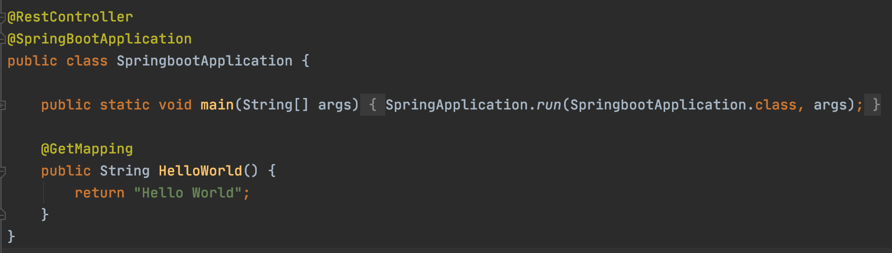

# 스프링 부트 환경 설정

<br>

## 스프링 부트 시작하기
### 프로젝트 생성
* JDK 설치
* 인텔리제이 IDEA 사용하기
* 프로젝트 유형을 그레이들로 선택해 프로젝트 생성

### HelloWorld


* `@RestController`
    - @Controller와 @ResponseBody를 합쳐놓은 역할을 수행된다.  
    - 어노테이션을 사용하면 반환값이 Response Body 부분에 자동으로 바인딩된다.  
    - 스프링에서 RESTful 웹 서비스를 만들 때 주로 사용
* `@GetMapping`
    - Get 방식으로 경로를 받는 매핑 어노테이션
    - value 값을 별도로 지정하지 않으면 기본값인 빈 값이 들어간다.
    
* 메인 메서드를 실행한 후 브라우저에서 `localhost:8080`에 접속하여 "Hello World"가 제대로 출력되는지 확인한다.

<br>

## 그레이들
### 그레이들과 메이븐의 특징
* 그레이들
    - 기본적인 빌도 도구의 기능
    - 메이븐으로부터 의존 라이브러리 관리 기능을 차용
    - 멀티 프로젝트 구성 시 설정 주입 방식을 사용
* 메이븐
    - 메이븐 설정 파일인 pom.xml은 XML 기반으로 작서
    - 동적인 행위에 제약이 존재
    - 멀티 프로젝트 구성 시 상속 구조로 이루어짐
    
### 그레이들 프로젝트 구조
```
├── gradle
|    └── wrapper
|        ├── gradle-wrapper.jar
|        └── gradle-wrapper.properties
├── gradlew
└── gradlew.bat
```
* gradlew
    - 리눅스 및 맥 OS용 셸 스크립트
    - 버전 변경 명령어
        - `./gradlew wrapper --gradle-version 4.10.2`
* gradlew.bat
    - 윈도우용 배치 스크립트
* gradle/wrapper/gradle-wrapper.jar
    - Wrapper JAR
* gradle/wrapper/gradle-wrapper.properties
    - 그레이들 설정 정보 프로퍼티 파일(버전 정보 등)
    - distributionUrl을 원하는 그레이들 버전으로 수정
    
위의 파일은 모두 그레이들 래퍼와 관련된 설정이며 프로젝트 첫 설정 시 그레이들 관련 빌드 설정을 자동으로 해준다.  

### 그레이들 멀티 프로젝트 구성하기
* 그레이들 멀티 프로젝트를 활용하면 여러 프로젝트를 마치 하나의 프로젝트처럼 사용할 수 있다.  
    - 이 기능은 공통 코드를 하나의 프로젝트로 분리하고 이를 재사용할 때 유리하다.  

1. setting.gradle 파일에 루트 프로젝트를 추가한다.
    - setting.gradle 파일 : 그레이들 설정 파일
    - 특정한 명령 규칙에 따라 그레이들에서 자동으로 인식하여 설정한다.
    - rootProject.name = 'SpringBoot-study'
    
2. `SpringBoot-study-web` 모듈을 생성한다.
    - 루트 경로에서 New - Module 선택

3. ArtifactId에 `SpringBoot-study-web`을 입력한 후 모듈을 생성한다.

4. `SpringBoot-study-web` 모듈에는 build.gradle 파일만 존재한다.
    - 기본 패키지 경로는 수동으로 생성
    - src/main/java : 자바 소스 경로
    - src/test/java : 스프링 부트의 테스트 코드 경로
    - src/main/resources/static : static한 파일(css, image, js 등)의 디폴트 경로
    - src/main/resources/templates : thymeleaf, freemarker 및 기타 서버 사이드 템플릿 파일의 경로

<br>

## Reference & Additional Resources
> 처음 배우는 스프링 부트2


